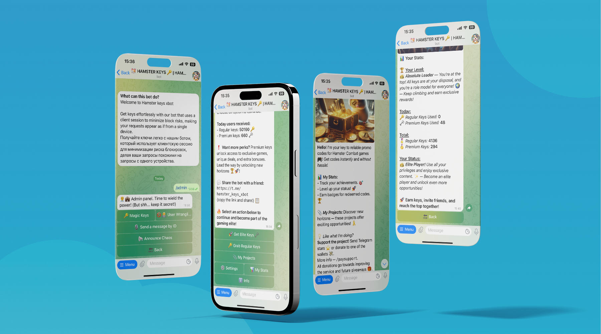

# Hamster Keys Generator

[](https://www.python.org/)
[](https://www.postgresql.org/)
[](https://www.sqlalchemy.org/)
[](https://aiogram.dev/)
[](https://flake8.pycqa.org/en/latest/)



## Table of Contents

- [Project Description](#project-description)
- [Main Features](#main-features)
- [Installation](#installation)
- [Environment Configuration](#environment-configuration)
- [Running with Docker](#running-with-docker)
- [Commands](#commands)
- [Continuous Integration/Continuous Deployment (CI/CD)](#continuous-integrationcontinuous-deployment-cicd)
- [Project Structure](#project-structure)
- [Contributing](#contributing)
- [License](#license)


## Project Description
The [Hamster Keys Generator](https://t.me/hamster_keys_xbot) project is a system that automatically generates promo codes for various games.
User interaction is handled through a Telegram bot, while code generation and management, 
using proxy servers to send requests to game APIs, ensure seamless integration with game platforms.
A `PostgresSQL` database is used for storing promo codes, and sessions and requests are processed asynchronously with the `aiohttp` library.

#### The project utilizes:
- `Alembic` for database migrations,
- `SQLAlchemy` for database interaction,
- `Aiogram` for working with the Telegram API,
- `Docker` for containerization.

## Main Features:

### Farmer
- **Automatic promo code generation and database storage for games**.
  - Easily generate promo codes for multiple games and automatically save them in the database.
- **Detailed logging and error handling**.
  - All stages of the generation process are logged for transparency, and in case of errors, the farmer automatically restarts on a timed schedule.
- **Proxy support for API requests**.
  - Ensures reliable API access even when geographical restrictions or rate limits are in place.

### Telegram Bot
- **Key distribution**.
  - Quick access for users to claim keys via a multilingual interface.
- **Admin commands**.
  - Manage users and bot settings with powerful admin tools.
- **Request rate-limiting**.
  - Controls the number of promo code requests per user to prevent abuse.
- **Boosted key counts (`POPULARITY_COEFFICIENT`)**.
  - Displays inflated key counts to attract more users.
- **Multilingual support**.
  - Easy switching between languages for a global audience.
  - **Supported languages**: `en`, `ru`, `uk`, `sk`, `es`, `fr`, `tr`, `ar`
- **Donation system (XTR stars)**.
  - Users can donate using fixed or custom amounts of Telegram stars.
  - Includes payment confirmation, cancellation, and refund options.
- **Referral links**.
  - **Add your referral links**: Promote your projects by adding referral links. 
  Encourage users to invite others and get bonuses in return.
- **Achievement system**.
  - **Track user progress**: Users can unlock achievements based on their activity and receive special rewards as they progress.

## Installation

### Requirements
- Python 3.10+
- PostgreSQL 16.3+
- Docker (for deployment using Docker Compose)

### Installing Dependencies
Install the required dependencies with:
```sh
pip install -r requirements.txt
```

## Environment Configuration
Create a `.env` file in the project root directory based on the provided `.env.example` file. 
Fill it with the following parameters:
```plaintext
DATABASE_NAME=your_database_name
DATABASE_USER=your_database_user
DATABASE_PASSWORD=your_database_password
DATABASE_HOST=your_database_host
DATABASE_PORT=your_database_port

BOT_TOKEN=your_telegram_bot_token
GROUP_CHAT_ID=your_group_chat_id
POPULARITY_COEFFICIENT=1
```

## Running with Docker
1. Build and start the containers using Docker Compose:
```sh
docker-compose up -d postgres
```
2. Apply migrations and set up the database:
```sh
alembic upgrade head
```

### Running the Bot
After setting up the database and configuration, you can start the bot with Python:
```sh
python bot/main.py
```

### Running the Farmer
The farmer can be started as a separate process:
```sh
python app/main.py
```

### Logging
Logs are saved in the `logs` directory. 
Log files are rotated when they reach 10 MB, with up to 5 backup copies retained.


## Commands

### User Commands
- `/start` – Start the bot
- `/change_lang` – Change the language
- `/paysupport` – Support via donations

### Admin Commands
- `/admin` – Open admin panel


## Continuous Integration/Continuous Deployment (CI/CD)
This project uses **GitHub Actions** for:

- **Linting** with Flake8 on every push,
- **Building** and deploying when changes are pushed to the main branch,
- **Auto-release** creation for new tags.

### Configuration
Make sure to configure the following ***GitHub Secrets*** for deployment:

- ***HOST:*** The remote server host.
- ***USERNAME:*** The SSH username.
- ***PORT:*** The SSH port.
- ***SSHKEY:*** The private SSH key for connecting to the remote server.


## Project Structure
```commandline
.
├── app                  # Logic of generating promo codes
│   ├── main.py
│   ├── game_promo_manager.py
│   ├── games.py
│   ├── database.py
│   ├── models/
│   └── proxies.txt
├── bot                  # Telegram bot
│   ├── main.py
│   ├── config.py
│   ├── handlers/
│   ├── translations/
│   └── keyboards/
├── alembic              # Database migrations
│   ├── versions/
│   └── env.py
├── backups              # Database backups
├── docker-compose.yml   # Docker configuration
├── requirements.txt     # Project dependencies
├── .env                 # Environment Configuration
└── README.md            # Project Description
```
## Contributing
We welcome contributions to Hamster-code-generator. To contribute:

1. Fork the repository.
2. Create a new branch for your changes.
3. Make your changes and commit them to your branch.
4. Update your branch from the main repository:
    ```sh
    git fetch upstream
    git merge upstream/main
    ```
5. Submit a pull request.

We will review your pull request and provide feedback as needed.

## License
This project is licensed under the MIT License. 
See the LICENSE file for more information.